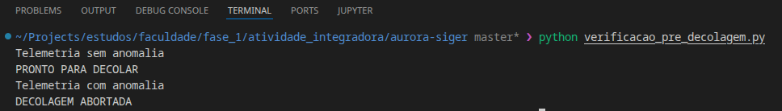
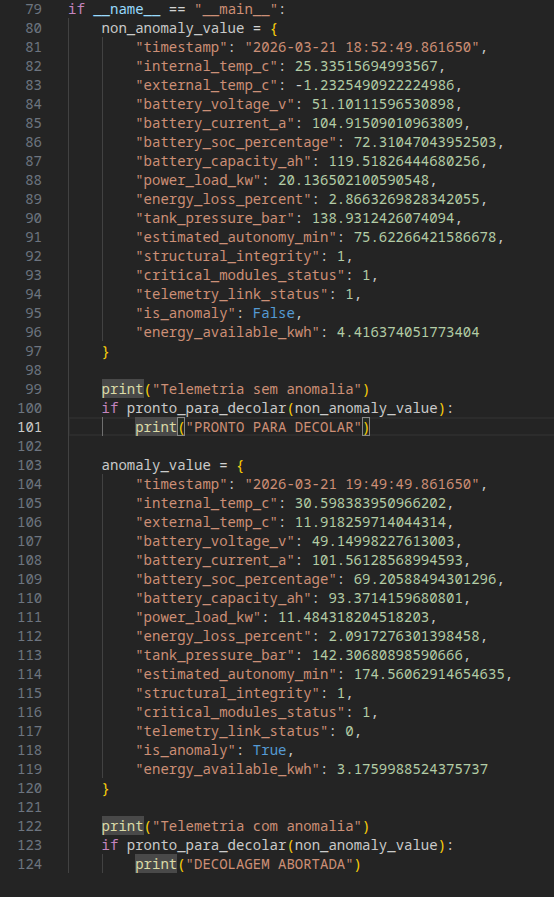

# Missão Aurora Siger
---
**Autores:** André Raposo, Google Gemini  
Projeto para a Atividade Integradora da Fase 1 do curso de Ciência da Computação da FIAP.

## Introdução

O projeto tem como objetivo simular de forma simplificada o ecossistema de missões espaciais sob a perspectiva da Ciência da Computação.

A missão simulada foi batizada de Aurora Siger e integra diversas áreas analíticas e computacionais, tais como:
- Lógica digital;
- Algoritmos;
- Automação em Pythion;
- IA como suporte analítico;
- Eficiência energética;
- Responsabilidade ética e sustentável.

### Instruções de execução
**Método 1 - Google Colab**
1. Importar o projeto na plataforma Google Colab
2. Abrir o arquivo `aurora_siger.ipynb`
3. Executar os blocos de código em ordem

**Método 2 - Execução local**
1. Realizar o download do projeto
2. Abrir o projeto em uma IDE com suporte a notebooks Jupyter. (Ex: Visual Studio Code)
3. Ativar o ambiente virtual (venv) utilizando o comando:
    Windows: `.venv\Scripts\activate`
    Unix/macOS: `source .venv/bin/activate`
4. Realizar o download das dependencias do projeto com o comando `pip install -r requirements.txt`
5. Abrir o arquivo `aurora_siger.ipynb`
6. Executar os blocos de código em ordem

### Print da execução
Execução direta do algoritmo `verificacao_pre_decolagem.py`.

Executando o arquivo diretamente o seguinte trecho é executado:

O trecho define um caso regular e um caso de anomalia, imprimindo "PRONTO PARA DECOLAR" e "DECOLAGEM ABORTADA" respectivamente

